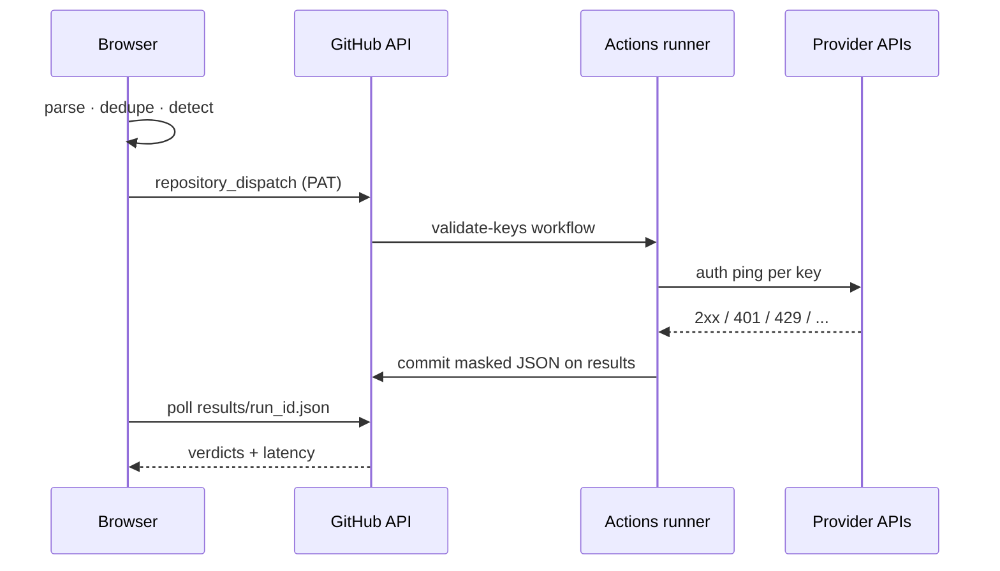

<p align="center">
  
</p>

<h1 align="center">AI Key Validator</h1>

<p align="center">
  <strong>Bulk-check 113 API key formats against real provider auth endpoints.</strong><br/>
  Your browser · your GitHub Actions runner · zero third-party backend.
</p>

<p align="center">
  <a href="https://api-key-validator.bossincrypto.dev"></a>
  <a href="#supported-providers"></a>
  <a href="#stack"></a>
  <a href="#license"></a>
</p>

<p align="center">
  <a href="https://api-key-validator.bossincrypto.dev"><b>Open the live app →</b></a>
  &nbsp;·&nbsp;
  <a href="#60-second-setup">Setup</a>
  &nbsp;·&nbsp;
  <a href="#how-it-works">Architecture</a>
  &nbsp;·&nbsp;
  <a href="#supported-providers">Providers</a>
</p>

---

## The problem

You rotated a batch of keys. Or inherited a `.env` graveyard. Or need a pre-deploy sanity check across OpenAI, Anthropic, Gemini, Stripe, Supabase, and thirty other services.

Most “key checkers” want your secrets on *their* server.

**akv does not.**

```text
  your keys  ──►  your browser  ──►  your fork’s Actions runner  ──►  provider APIs
                      │                        │
                      └──── localStorage PAT ──┘
                           (never our backend — there isn’t one)
```

---

## What you get

| | |
| :--- | :--- |
| **Auto-detect** | 113 regex-backed formats: `sk-proj-…`, `sk-ant-…`, `AIza…`, `xai-…`, `gsk_…`, … |
| **Real auth pings** | Cheap authenticated endpoints (models list, whoami, credits) — not fake format checks |
| **Clear verdicts** | `valid` · `invalid` · `rate_limited` · `error` + HTTP status + latency + response snippet |
| **Masked everywhere** | UI and results store `sk-proj…abcd` only — full keys never written back |
| **CSV export** | One click after a run |
| **Hard ceiling** | Up to 500 keys per run, parallelized on the runner |
| **Zero backend** | Static SPA on GitHub Pages + one workflow on *your* fork |

---

## 60-second setup

**1.** Open **[api-key-validator.bossincrypto.dev](https://api-key-validator.bossincrypto.dev)**

**2.** [Fork this repo](https://github.com/BOSSincrypto/api-key-validator/fork)

**3.** Create a [fine-grained PAT](https://github.com/settings/personal-access-tokens/new) limited to **that fork**:

| Permission | Access |
| --- | --- |
| **Actions** | Read and write |
| **Contents** | Read and write |
| **Metadata** | Read (automatic) |

**4.** In the app: paste `owner` / `repo` / token → **Connect**  
(stored only in `localStorage`)

**5.** Paste keys → **Validate**  
Cold starts usually land in **15–40s**.

> Tip: for production-grade keys, use a short-lived PAT on a **private** fork.

---

## How it works



1. SPA parses the paste, dedupes lines, matches each key to a provider.
2. Your PAT fires `repository_dispatch` → `validate-keys` workflow.
3. Runner (`scripts/validate.mjs`) batches requests (15s timeout each).
4. Masked JSON lands on the orphan **`results`** branch (files older than 24h pruned).
5. SPA polls the Contents API until the run file appears.

Deploy path is separate: every push to `main` rebuilds the SPA and ships it to Pages automatically.

---

## Local development

Requires [Bun](https://bun.sh).

```bash
bun install
bun dev          # http://localhost:8080
bun run build    # → dist/
bun run preview  # serve production build
```

No `VITE_*` secrets for the Actions validation path.

| Script | Purpose |
| --- | --- |
| `bun dev` | Vite dev server |
| `bun run build` | Production bundle |
| `bun run preview` | Local prod preview |
| `bun run lint` | ESLint |

---

## Supported providers

### AI / LLMs
OpenAI · Anthropic · Google Gemini · xAI (Grok) · Groq · Mistral · DeepSeek · OpenRouter · Perplexity · Cohere · Together · Fireworks · Cerebras · Novita · Anyscale · Hugging Face · Replicate · NVIDIA · GitHub Models · Hyperbolic · SambaNova · AI21 · Friendli · GLHF · Zhipu

### Voice / Audio / Video
ElevenLabs · AssemblyAI · Deepgram · Cartesia · Stability · Runway · Luma · Twelve Labs

### Embeddings / Vector / Search
Voyage · Jina · Nomic · Pinecone · Exa · Tavily · Brave Search · Firecrawl

### Infra / DevOps
Supabase · Neon · Netlify · Render · Sentry · New Relic · Databricks · Snyk · Modal · Baseten · Runpod · Fal · Segmind · DataStax · Trigger.dev · Xata · Buildkite · CircleCI · Docker Hub · npm · GitLab · Bitbucket · LaunchDarkly · Statsig · Honeybadger

### Product / Growth / Comms
Resend · SendGrid · Brevo · MailerSend · Courier · Notion · Linear · Airtable · HubSpot · Stripe · Discord · Intercom · Klaviyo · Contentful · Cal.com · Asana · ClickUp · Figma · Dropbox · Typeform · Twitter/X · Pushbullet · Modrinth

### Data / Utility
DeepL · PostHog · LangSmith · Langfuse · Helicone · Portkey · Browserbase · Apify · OpenPipe · PromptLayer · ScrapingBee · Scrapfly · Mem0 · Tinybird · CoinGecko · AbuseIPDB · Pexels · Pixabay · WolframAlpha · IPinfo · CurrencyAPI · Duffel · Leonardo

Registries (keep in sync when adding providers):

| File | Role |
| --- | --- |
| [`src/lib/providers.ts`](src/lib/providers.ts) | UI detection (`keyPattern`) + labels |
| [`scripts/providers.mjs`](scripts/providers.mjs) | Runner HTTP specs |

---

## Add a provider

Two files. Distinctive prefix. Cheapest auth-looking endpoint that returns **2xx vs 401/403**.

```ts
// src/lib/providers.ts — detection + UI
{
  id: "acme",
  name: "Acme",
  keyPattern: /^acm_[A-Za-z0-9]{32,}$/,
  // ...
}
```

```js
// scripts/providers.mjs — runner call
acme: { m: "GET", u: "https://api.acme.com/v1/me", h: "Authorization" },
```

Open an issue with **Request provider** if you want something added for you.

---

## Security model

| Surface | Behavior |
| --- | --- |
| SPA | Full keys only live in memory for the run; display is masked |
| PAT | Browser `localStorage` only — never sent to us (no us) |
| Runner | Keys used for outbound provider calls; results store **masked** keys |
| `results` branch | Auto-pruned after 24h |
| Analytics | None |

Treat this as a **diagnostic tool**, not a vault. Rotate anything you validated on infra you do not fully control. Prefer a short-lived fine-grained PAT on a private fork for production keys.

---

## Stack

| Layer | Tech |
| --- | --- |
| UI | React 19 · TypeScript 5 · Tailwind 4 |
| Build | Vite 7 · Bun |
| Runtime | GitHub Actions (`validate-keys`) |
| Hosting | GitHub Pages · custom domain |

### Deploy workflows

| Workflow | Trigger | What it does |
| --- | --- | --- |
| [`deploy.yml`](.github/workflows/deploy.yml) | push `main` / manual | Build SPA → Pages |
| [`validate-keys.yml`](.github/workflows/validate-keys.yml) | `repository_dispatch` | Validate keys → `results` branch |

### Custom domain

**https://api-key-validator.bossincrypto.dev**

| Type | Host | Answer |
| --- | --- | --- |
| `CNAME` | `api-key-validator` | `bossincrypto.github.io` |

Fallback: https://bossincrypto.github.io/api-key-validator/

---

## Project layout

```text
.
├── .github/workflows/     # Pages deploy + key validation
├── scripts/               # Runner: validate.mjs + providers.mjs
├── src/
│   ├── components/        # Setup, Validator, Results, provider list
│   └── lib/               # detect, dispatch, mask, providers
├── public/CNAME           # api-key-validator.bossincrypto.dev
└── package.json
```

---

## License

[MIT](LICENSE) — use it, fork it, audit it.

---

<p align="center">
  <sub>Built for operators who rotate keys faster than they inventory them.</sub><br/>
  <a href="https://api-key-validator.bossincrypto.dev"><b>Try it live →</b></a>
</p>
